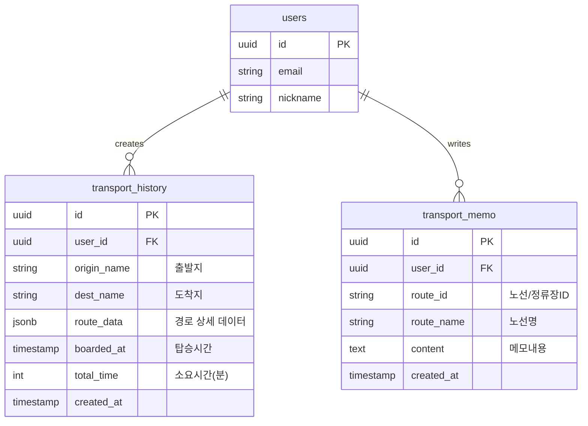

# 버스타볼까 데이터베이스 스키마 (DB_SCHEMA)

## 1. ERD 개요


## 2. SQL 스키마 (Supabase)

```sql
-- 1. Users (Supabase Auth 연동)
create table public.users (
  id uuid references auth.users(id) on delete cascade primary key,
  email text not null,
  nickname text,
  created_at timestamptz default now()
);

-- 2. Transport History (FEAT-2)
create table public.transport_history (
  id uuid default gen_random_uuid() primary key,
  user_id uuid references public.users(id) on delete cascade not null,
  origin_name text not null,
  dest_name text not null,
  route_data jsonb, -- API로 받은 경로 정보 스냅샷
  boarded_at timestamptz default now(),
  total_time int,
  created_at timestamptz default now()
);

-- 3. Transport Memo (FEAT-3)
create table public.transport_memo (
  id uuid default gen_random_uuid() primary key,
  user_id uuid references public.users(id) on delete cascade not null,
  route_id text not null, -- 버스 번호 or 정류장 ID
  route_name text,
  content text not null,
  created_at timestamptz default now()
);

-- RLS (Row Level Security) 설정
alter table public.users enable row level security;
alter table public.transport_history enable row level security;
alter table public.transport_memo enable row level security;

-- 본인 데이터만 접근
create policy "Users view own data" on public.transport_history
  for select using (auth.uid() = user_id);

create policy "Users insert own data" on public.transport_history
  for insert with check (auth.uid() = user_id);

-- (Memo 테이블도 동일하게 적용)
```
